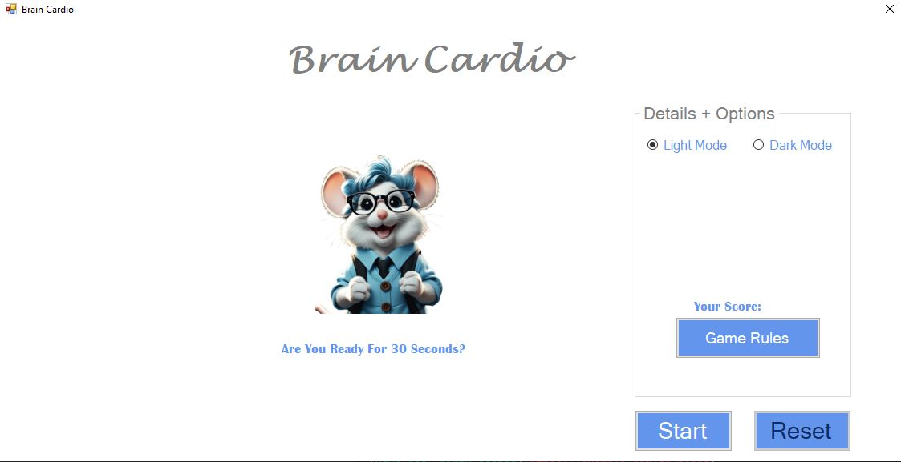
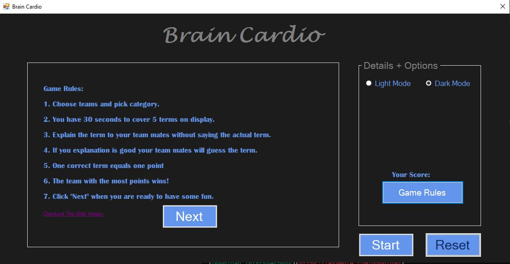
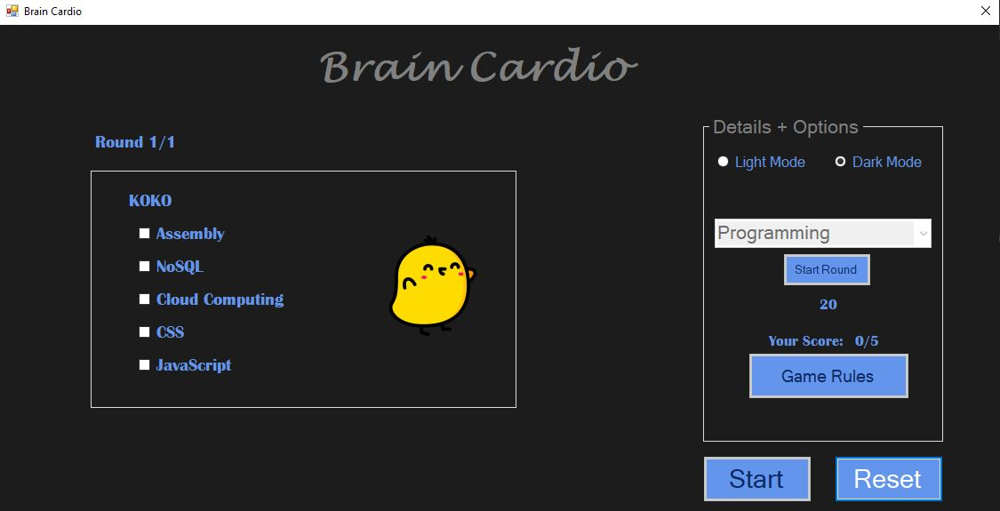

# ThirtySeconds 🎉

ThirtySeconds is a .NET Windows Forms game designed for fun and engaging group play. The game allows two teams to compete across multiple rounds, with categories and a timer adding to the excitement.

## Features 🌟
- **Team Play**: Compete in teams with customizable names and images.  
- **Multiple Rounds**: Choose the number of rounds for endless fun.  
- **Category Selection**: Pick a category for each round for a unique challenge.  
- **Timer for Each Turn**: Keep the gameplay fast-paced and exciting with a turn timer.  
- **Simple and Intuitive**: Easy-to-use interface for smooth gameplay.

## How to Play 📖
1. **Start the Game**: Launch the application.  
2. **Set Up Teams**: Enter the names and upload the images for both teams.  
3. **Choose Rounds**: Enter the number of rounds to play.  
4. **Select Categories**: For each round, select a category.  
5. **Play the Rounds**: Click **Start Round** to begin the timer for the first turn. The drill repeats with alternating turns until all rounds are complete.  
6. **Enjoy and Compete**: Celebrate the winning team at the end!

## Live Demo 🔗
Try out the game by downloading it using the link below:  
[Download ThirtySeconds](https://drive.google.com/file/d/1mqhrRYYsBbtbFJ7UduoTtRB1a5pOvgyk/view?usp=drive_link)  

## Requirements 🛠️
- **.NET Framework**: Version 4.7.2 or higher  
- **Operating System**: Windows 7 or later  

## Installation 🖥️
1. Clone the repository:  
   ```bash
   git clone https://github.com/MarwanDev/Thirty-Seconds.git

## Screenshots 🖼️
Take a look at the game in action:  

### Light Mode  
 

### Rules  
  

### Game Turn  
  


---
## Contributing 🤝
Contributions are welcome! Here's how you can help:  
1. Fork the repository.  
2. Create a feature branch (`git checkout -b feature-name`).  
3. Commit your changes (`git commit -m 'Add a new feature'`).  
4. Push to the branch (`git push origin feature-name`).  
5. Open a pull request.  

Feel free to open issues for bugs, suggestions, or enhancements.

## License 📜
This project is licensed under the [MIT License](LICENSE).  
